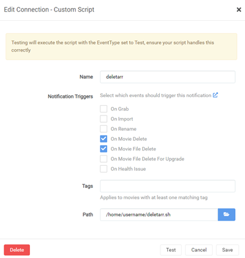

Disclaimer: A work in progress arr integration focused on qbittorrent. Use at your own risk.

Note: Currently only works with Radarr + qbittorent via the API - the rest to come

### Install

```bash
wget -qO ~/deletarr.sh git.io/deletarr
chmod 700 ~/deletarr.sh
```

Change these variables in the script
### Configure

```bash
host="http://127.0.0.1" # set your host here
port="8080"             # set your port here
category="radarr"       # your downloader category here - WIP to find a better way to determine this
```

Create a new connection for Settings/connection/Custom Script



### Script info

In Radarr you create a Settings/connection/Custom Script named deletarr and select only On Movie Delete

Then you set the path to this script - Testing will just return a success with an exit code 0 - the script does nothing on this test

Now when you delete a movie and the file it will trigger the script and do one of two things

Delete Movie only - This will just trigger the script to log the basic info about the movie and list available torrents to delete in the `~/.deletarr/movie_name.log`

Delete Movie and Movie files and folders - The script will log movie info and also try to delete the torrents and their files via the API - if this was uncommented.

Note: Until the last curl command is uncommented the script is informative and takes no action even if you chose to delete movie files.

This is to make sure you can see exactly  what it wants to do and assess the log, like a dry run, before action is taken.

You can view the `~/.deletarr/movie_name.log` created when the action is triggered for output info and troubleshooting
